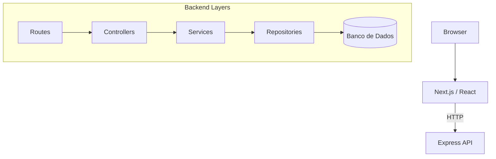

# Arquitetura do Adote Fácil

## Visão Geral
O repositório está organizado como um monorepo com dois módulos principais:

- **backend** – API REST construída com Node.js, Express e TypeScript.
- **frontend** – aplicação web criada com Next.js e React.

Os módulos comunicam-se via HTTP; o frontend consome os endpoints expostos pelo backend.

## Estilo Arquitetural
### Backend
O backend adota uma arquitetura em camadas. As rotas direcionam requisições para controladores, que delegam regras de negócio para serviços. Os serviços, por sua vez, manipulam dados através de repositórios que acessam o banco via Prisma.

### Frontend
O frontend utiliza a arquitetura de componentes do React com o framework Next.js (App Router), responsável por renderização no servidor e rotas da interface.

### Persistência
A persistência de dados é realizada em um banco relacional configurado via Prisma (o docker-compose utiliza PostgreSQL).

## Diagrama de Componentes

## Tecnologias Principais
- Node.js, Express, Prisma e TypeScript no backend.
- Next.js, React e Styled Components no frontend.
- PostgreSQL como banco de dados.
